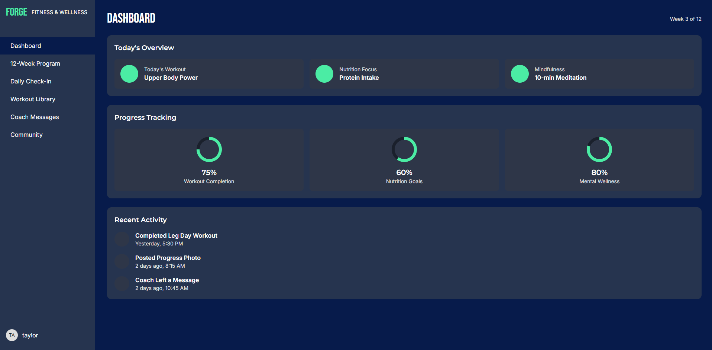
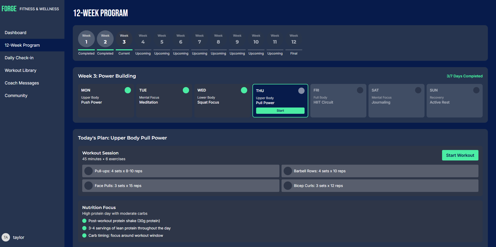
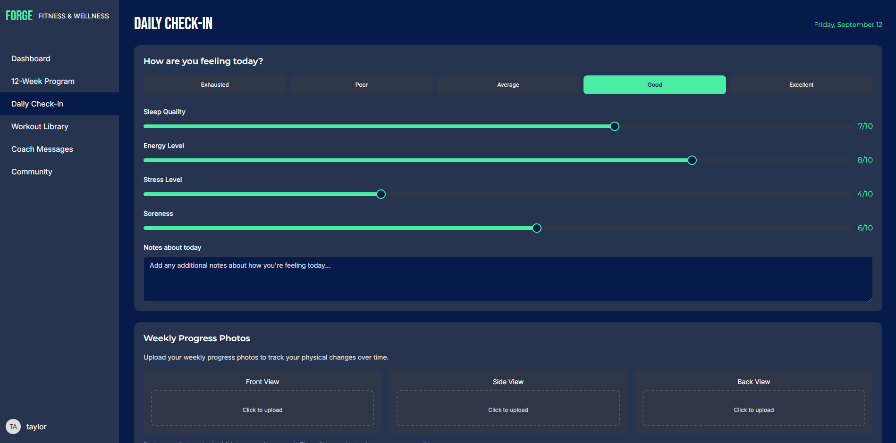
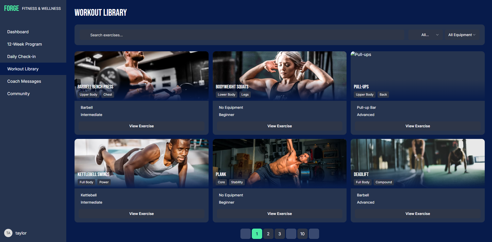
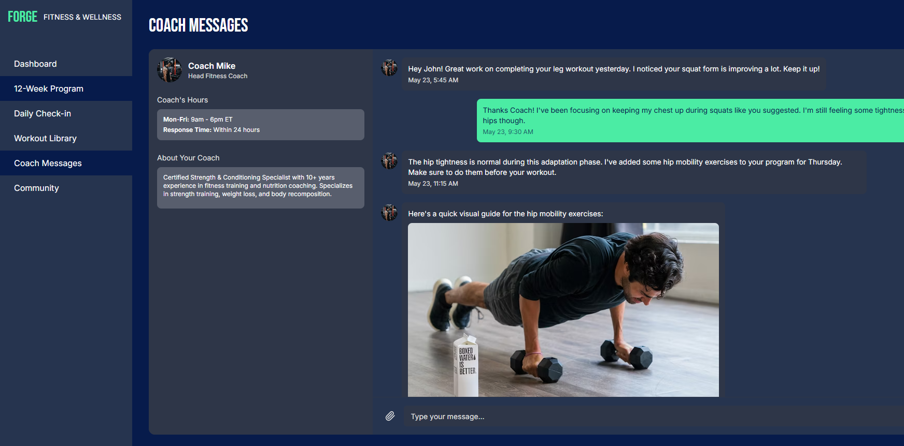
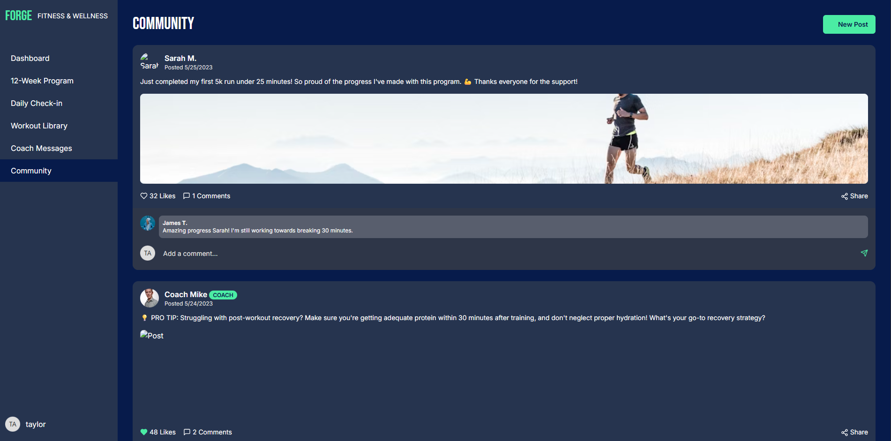
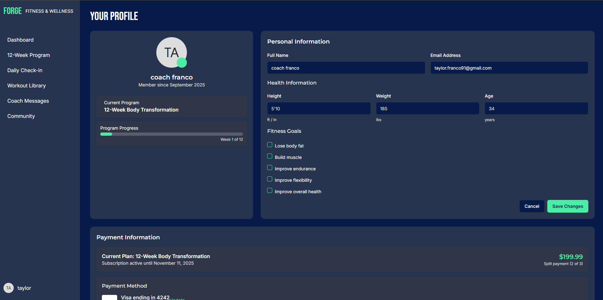

# Mind Body Reset — QA, Web Dev & AI Prompt Engineering Snippets  

This repository showcases my skills across **QA automation, frontend development, and prompt engineering**.  
With a focus on building reliable, user-friendly, and intelligent digital experiences. 

---

## 🔑 What’s Inside
- **Pytest Automation**  
  - Example test for a Stripe checkout button (`test_buy_now_change_your_life_main_purchase_button.py`).  
  - Demonstrates Selenium WebDriver, waits, and QA test structure.  

- **Frontend Snippets**  
  - `hero_section_tailwind.html` → Responsive hero section built with Tailwind CSS.  
  - `styles_snippet.css` → Custom CSS showing brand colors, CTA styles, and reusable classes.  

- **Prompt Engineering**  
  - Professional AI prompts used for **website copy, CTAs, testimonials, and automated workflows**.  
  - Demonstrates how I leverage AI to create content and improve user engagement.  

---

## 🎯 Purpose
This repo demonstrates my range as a:
- **Junior QA Engineer** → Automated + manual test practices.  
- **Frontend Web Developer** → Clean UI sections and styling.  
- **AI Prompt Engineer** → Leveraging AI for content, workflow automation, and digital strategy.  

---

## 🚀 How to Run the QA Test
1. Clone the repo  
   ```bash
   git clone https://github.com/taylor-franco-91/mind-body-reset-snippets.git

2. Install dependencies
pip install pytest selenium

3. Run The Test
pytest test_buy_now_change_your_life_main_purchase_button.py

---


## 📸 Screenshots  

Here’s a preview of the **Mind Body Reset Mobile App Prototype**:  

<div align="center">  

| Dashboard | 12-Week Program | Daily Check-in |  
|-----------|-----------------|----------------|  
| <br><sub>Main dashboard showing weekly plan and quick stats.</sub> | <br><sub>12-week structured program with milestones.</sub> | <br><sub>Track mood, meals, and hydration daily.</sub> |  

| Workout Library | Coach Messages | Community |  
|-----------------|----------------|-----------|  
| <br><sub>Exercise database with guided workouts.</sub> | <br><sub>Direct messages from your coach for accountability.</sub> | <br><sub>Group forum for encouragement and sharing results.</sub> |  

| Profile |  
|---------|  
| <br><sub>Personal profile with progress tracking and achievements.</sub> |  

</div>


## 👤 Author
**Taylor Franco**  
Junior QA Engineer | Web Developer | AI Prompt Engineer  

📌 [LinkedIn](https://www.linkedin.com/in/taylor-franco-982518140/)  
🌐 [Portfolio](https://taylor-franco-portfolio.netlify.app/)  
